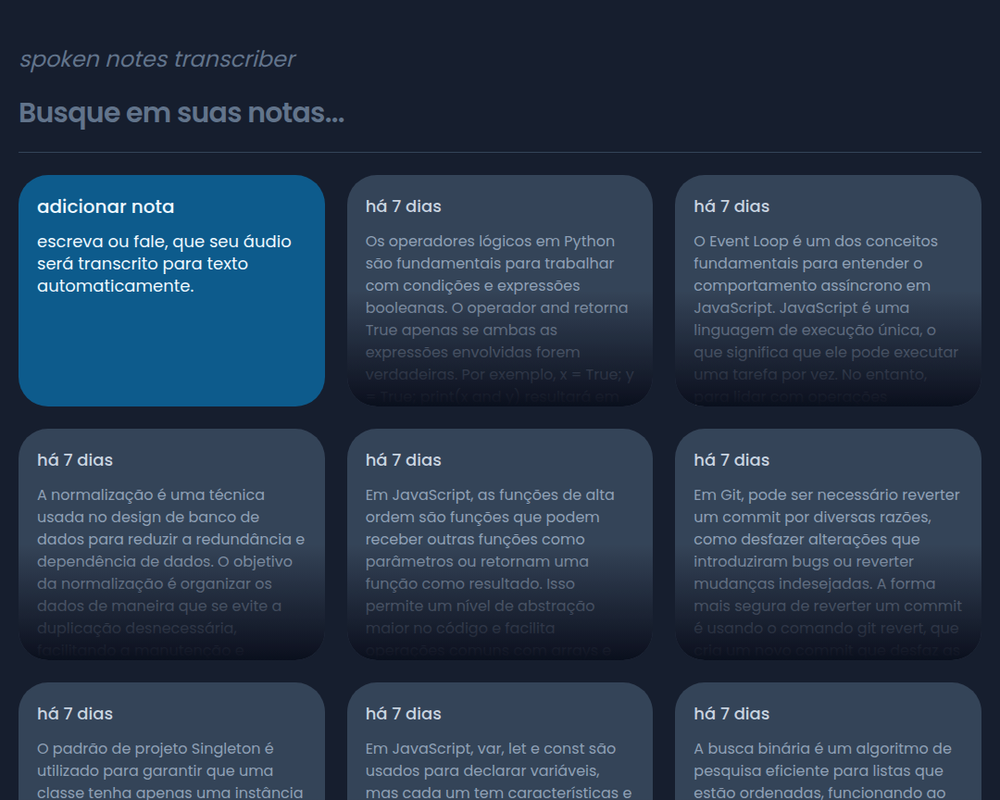
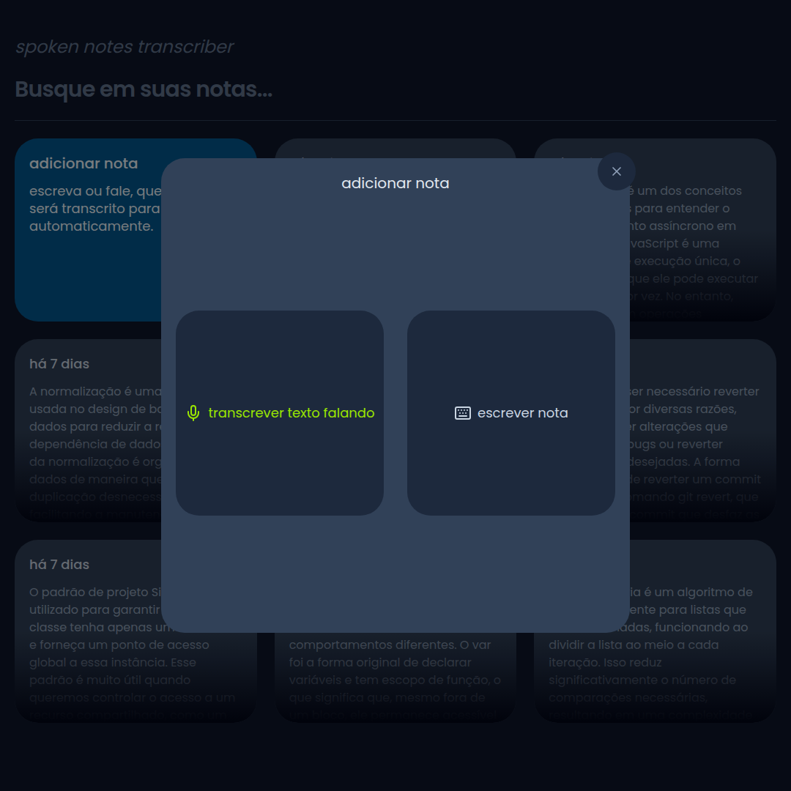
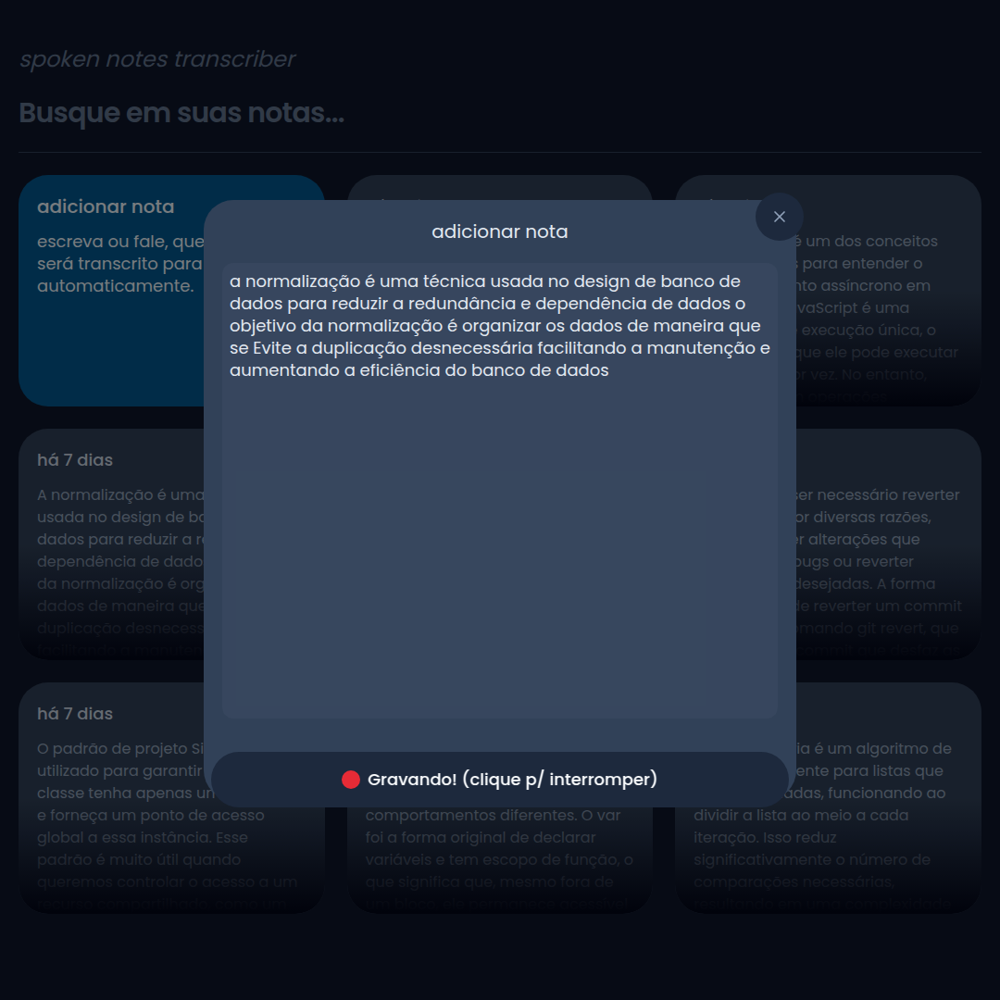
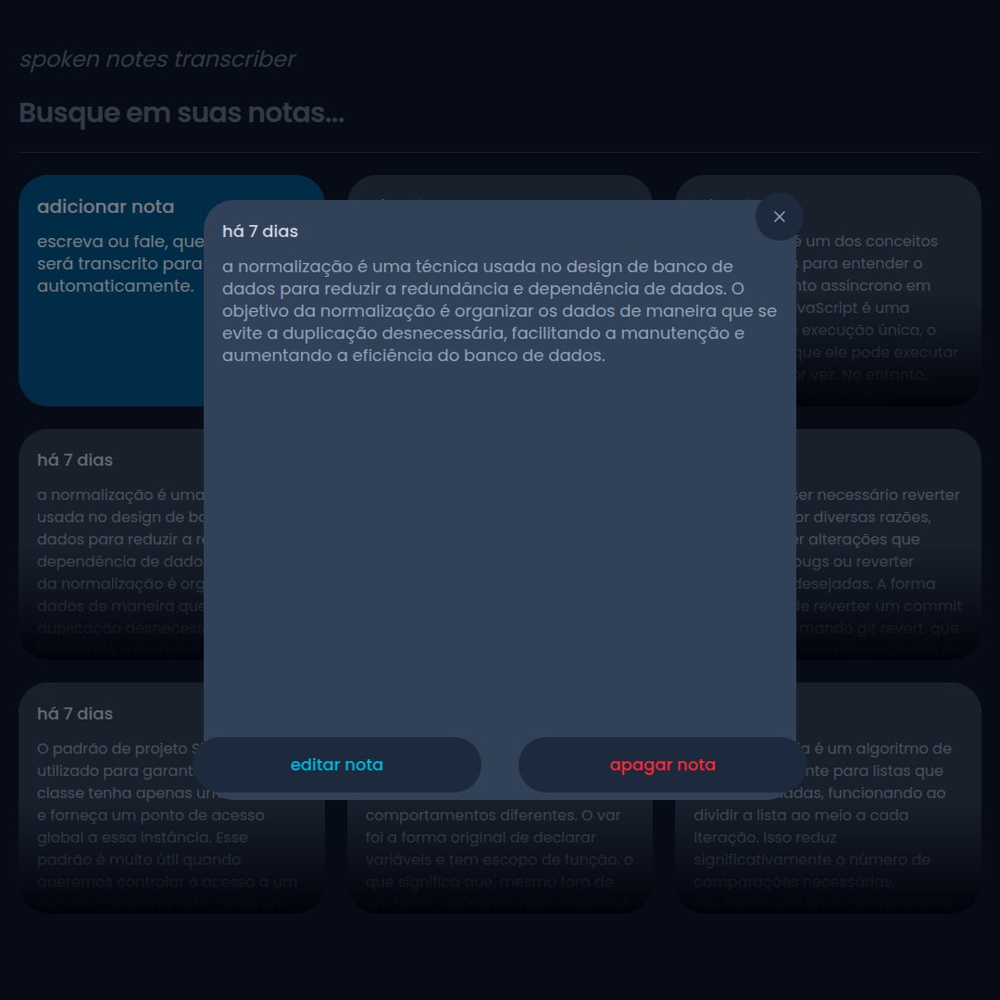

# Spoken Notes Transcriber

**Spoken Notes Transcriber** é uma aplicação web desenvolvida com React e TypeScript, que utiliza a API de Reconhecimento de Fala para transcrever áudio para texto. A ferramenta visa facilitar a criação e organização de notas faladas, tornando a transcrição de áudio rápida e precisa.

## ⚙️ Funcionalidades
- **Transcrição de Áudio para Texto**: Converte gravações de áudio em texto de maneira precisa e rápida.
- **Armazenamento e Organização de Notas**: Permite armazenar as transcrições de áudio e organizá-las em notas para fácil acesso e revisão posterior.
- **Interface Intuitiva**: A interface do usuário é simples e fácil de navegar, com recursos intuitivos para iniciar e parar a gravação.
- **Acessibilidade**: O aplicativo é ideal para pessoas com dificuldades de digitação, ou para quem deseja tomar notas rapidamente enquanto realiza outras tarefas.

## 🛠 Tecnologias Utilizadas
- **React**: Biblioteca JavaScript para construir interfaces de usuário.
- **TypeScript**: Superset do JavaScript, adicionando tipagem estática para melhorar a manutenção e confiabilidade do código.
- **Speech Recognition API**: API para reconhecimento de fala que converte áudio em texto.
- **Tailwind CSS**: Estilos para a construção da interface da aplicação.

## 🚀 Acesse o Projeto
Você pode acessar o projeto online através do seguinte link:

[**Clique aqui para acessar**](https://spoken-notes-transcriber.vercel.app/).

---

## 📸 Capturas de Tela
Aqui estão algumas capturas de tela do projeto em funcionamento:

---

## 🧑‍💻 Software Design

Este projeto foi desenvolvido com foco em seguir boas práticas de design de software, buscando garantir a escalabilidade e a manutenibilidade do código. A arquitetura adotada, **MVC (Model-View-Controller)**, proporciona separação de responsabilidades entre os dados (Model), a lógica de controle (Controller) e a interface de usuário (View).

---

Feito com 💙 por [francisverissimo](https://francissportfolio.vercel.app/)